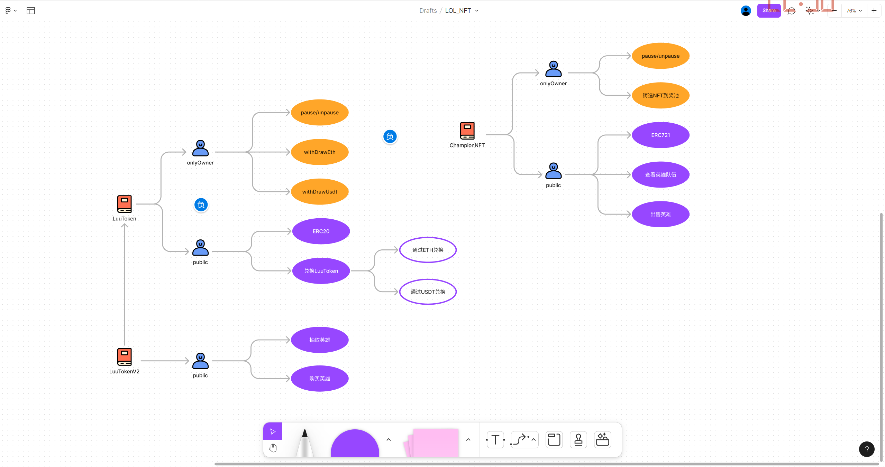
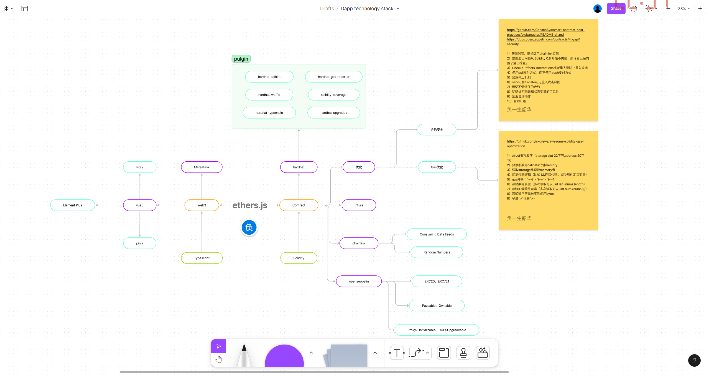
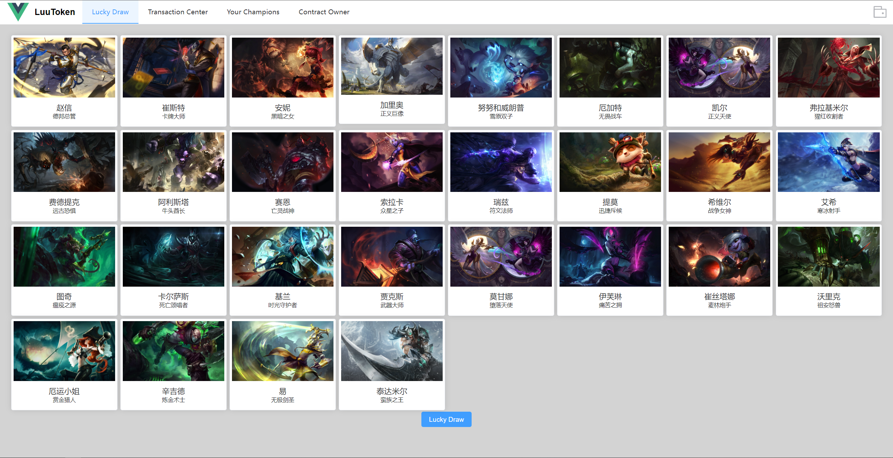
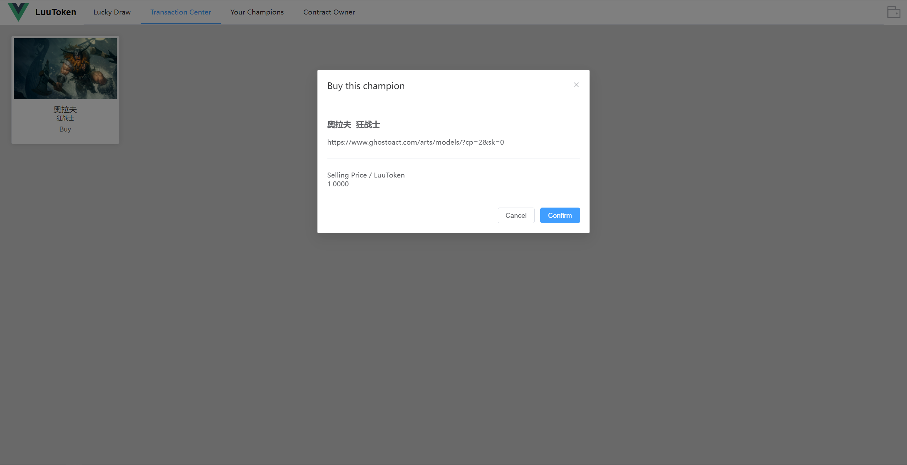
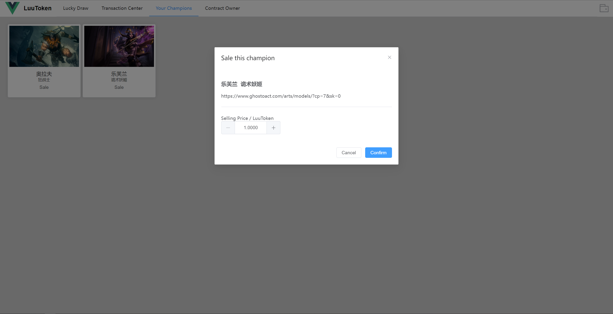
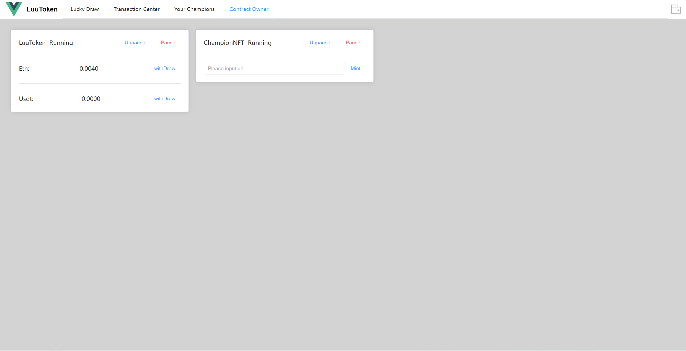
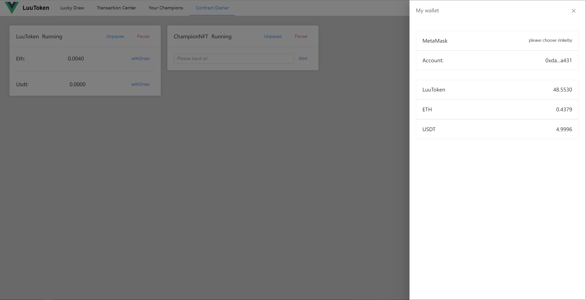
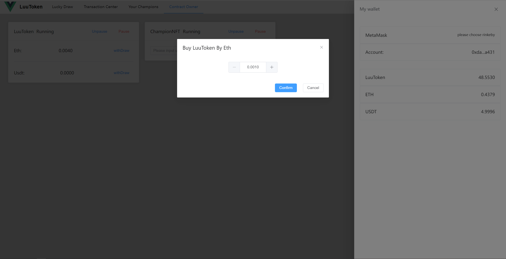

# lol-nft

## Function Introduction
功能介绍

LuuToken合约使用ERC20协议，ChampionNFT合约使用ERC721协议，主要功能有兑换token，抽取英雄，购买英雄，出售英雄等功能。

功能以及合约结构示意图如下：

https://www.figma.com/file/Pz8SwM6pyeMQjV5LM4QlmY/LOL_NFT?node-id=0%3A1

## Technology Introduction
技术介绍
### contract目录为solidity项目
- 模板为https://github.com/paulrberg/hardhat-template
- solidity编写合约
- typescript编写测试，部署等脚本
- Hardhat作为测试工具，
- TypeChain生成合约接口
- Ethers进行合约交互
- Hardhat-Plugins : hardhat-waffle、hardhat-solhint、 hardhat-typechain、hardhat-upgrades、solidity-coverage、hardhat-gas-reporter

### web3目录为Vue3项目
- typescript编写，
- 前端框架Vue3
- 脚手架vite2,
- 状态管理pinia
- UI框架Element Plus
- 钱包插件MetaMask

### 技术栈
https://www.figma.com/file/cRoKlbvXyhKqX23hAiOY26/Dapp-technology-stack?node-id=0%3A1

## Project 
幸运抽奖

交易中心

出售英雄

合约管理

账号管理

Token兑换

